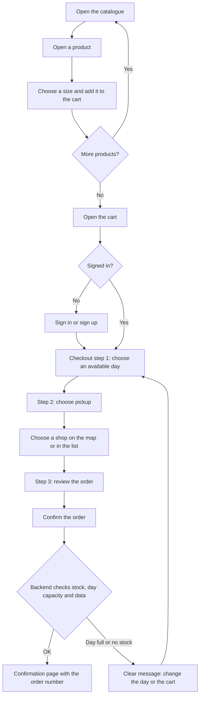
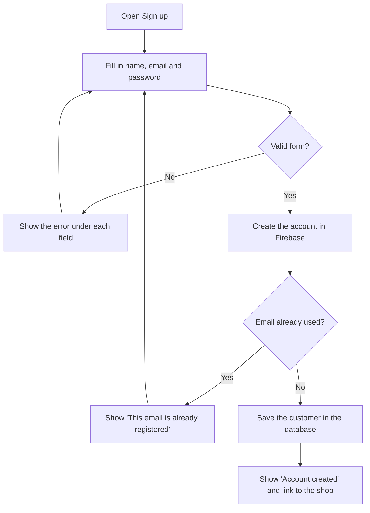
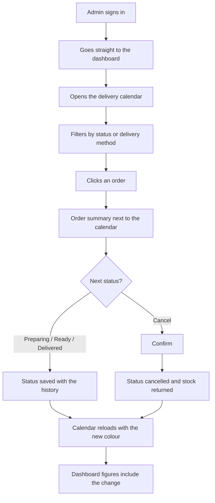

# User flows

## 1. Buying with pickup at a shop

```mermaid
flowchart TD
  A[Open the catalogue] --> B[Open a product]
  B --> C[Choose a size and add it to the cart]
  C --> D{More products?}
  D -- Yes --> A
  D -- No --> E[Open the cart]
  E --> F{Signed in?}
  F -- No --> G[Sign in or sign up] --> H
  F -- Yes --> H[Checkout step 1: choose an available day]
  H --> I[Step 2: choose pickup]
  I --> J[Choose a shop on the map or in the list]
  J --> K[Step 3: review the order]
  K --> L[Confirm the order]
  L --> M{Backend checks stock, day capacity and data}
  M -- OK --> N[Confirmation page with the order number]
  M -- Day full or no stock --> O[Clear message: change the day or the cart] --> H
```

## 2. Signing up

```mermaid
flowchart TD
  A[Open Sign up] --> B[Fill in name, email and password]
  B --> C{Valid form?}
  C -- No --> D[Show the error under each field] --> B
  C -- Yes --> E[Create the account in Firebase]
  E --> F{Email already used?}
  F -- Yes --> G[Show 'This email is already registered'] --> B
  F -- No --> H[Save the customer in the database]
  H --> I[Show 'Account created' and link to the shop]
```

## 3. Managing an order in the admin area

```mermaid
flowchart TD
  A[Admin signs in] --> B[Goes straight to the dashboard]
  B --> C[Opens the delivery calendar]
  C --> D[Filters by status or delivery method]
  D --> E[Clicks an order]
  E --> F[Order summary next to the calendar]
  F --> G{Next status?}
  G -- Preparing / Ready / Delivered --> H[Status saved with the history]
  G -- Cancel --> I[Confirm] --> J[Status cancelled and stock returned]
  H --> K[Calendar reloads with the new colour]
  J --> K
  K --> L[Dashboard figures include the change]
```
